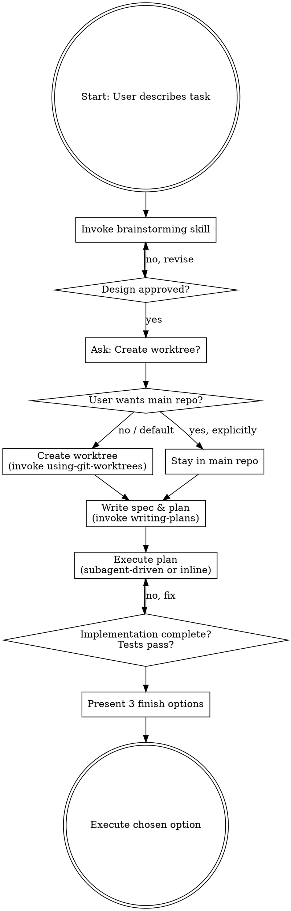

# DevBank Development Workflow

## Overview

Complete development lifecycle: brainstorm → isolate → plan → implement → finish. All feature work happens in isolated worktrees by default, keeping the main workspace clean.

**Core principle:** Think first, isolate always, finish cleanly.

## Process Flow



## Phase 1: Brainstorming

**REQUIRED SUB-SKILL:** Use superpowers:brainstorming

Follow the brainstorming skill completely — explore context, ask clarifying questions one at a time, propose approaches, present design, get approval, write spec.

**Do NOT skip brainstorming.** Even "simple" features need design validation.

## Phase 2: Worktree Isolation Gate

**After design approval, BEFORE writing the plan**, present the isolation choice:

> "Design approved! Before we start writing the implementation plan, I recommend creating an isolated worktree for this feature. This keeps your main workspace clean and makes it easy to discard or merge later.
>
> 1. **Create a new worktree (Recommended)** — isolated branch, clean workspace
> 2. **Work in the main repository** — develop directly on current workspace
>
> Which would you prefer?"

**Decision rules:**
- If user picks option 1 OR gives no clear preference → Create worktree
- If user **explicitly** says "main repo" / "no worktree" / "work here" → Stay in main repo
- Default is ALWAYS worktree creation

**If creating worktree:**
- **REQUIRED SUB-SKILL:** Use superpowers:using-git-worktrees
- Branch name: `feature/<short-descriptive-name>`
- All subsequent work (spec, plan, implementation) happens IN the worktree

**If staying in main repo:**
- Create a feature branch: `git checkout -b feature/<short-descriptive-name>`
- Continue in current workspace

## Phase 3: Write Spec & Plan

**REQUIRED SUB-SKILL:** Use superpowers:writing-plans

The spec doc from brainstorming should already be committed. Now write the implementation plan:
- Save to `docs/superpowers/plans/YYYY-MM-DD-<feature-name>.md`
- Follow writing-plans skill completely (file structure, bite-sized tasks, no placeholders, self-review)

## Phase 4: Execute Plan

**MANDATORY:** Before writing any implementation code, read `implementation-rules.md` in this skill directory and strictly follow all rules throughout the implementation.

Follow the execution handoff from writing-plans:
- **Subagent-Driven (recommended):** Use superpowers:subagent-driven-development
- **Inline Execution:** Use superpowers:executing-plans

Ensure all tests pass before proceeding.

## Phase 5: Finish

**After implementation is complete and all tests pass**, present exactly these 3 options:

```
Implementation complete, all tests passing. What would you like to do next?

1. Merge back to main and clean up — merge into <base-branch>, delete feature branch, remove worktree
2. Keep as-is — leave the branch and worktree intact, do nothing
3. Discard and clean up — abandon all changes, delete branch, remove worktree
```

### Option 1: Merge and Clean Up

```bash
# Get base branch
BASE=$(git symbolic-ref refs/remotes/origin/HEAD 2>/dev/null | sed 's@^refs/remotes/origin/@@' || echo "main")

# Switch to base branch
git checkout $BASE

# Pull latest
git pull

# Merge feature branch
git merge feature/<name>

# Verify tests still pass after merge
<run tests>

# Delete feature branch
git branch -d feature/<name>

# Remove worktree (if applicable)
git worktree remove <worktree-path>
```

Report: "Merged to `<base-branch>`, branch cleaned up, worktree removed."

### Option 2: Keep As-Is

Report: "Branch `feature/<name>` preserved. Worktree at `<path>` left intact. You can return to it anytime."

**Do nothing else.**

### Option 3: Discard and Clean Up

**Confirm first:**

```
WARNING: This will permanently delete:
- Branch: feature/<name>
- All commits on this branch
- Worktree at <path> (if applicable)

Type 'discard' to confirm.
```

Wait for exact typed confirmation. Then:

```bash
# Switch to base branch
git checkout $BASE

# Force delete feature branch
git branch -D feature/<name>

# Remove worktree (if applicable)
git worktree remove --force <worktree-path>
```

Report: "All changes discarded. Branch and worktree removed."

## Quick Reference

| Phase | Action | Sub-Skill |
|-------|--------|-----------|
| 1. Brainstorm | Explore idea, design, get approval | superpowers:brainstorming |
| 2. Isolate | Create worktree (default) or stay in main | superpowers:using-git-worktrees |
| 3. Plan | Write spec & implementation plan | superpowers:writing-plans |
| 4. Execute | Implement plan task by task | superpowers:subagent-driven-development or executing-plans |
| 5. Finish | Merge / Keep / Discard | — |

## Common Mistakes

### Skipping brainstorming for "simple" features

- **Problem:** Unexamined assumptions cause rework
- **Fix:** Always brainstorm. Design can be short, but must exist.

### Working in main repo by default

- **Problem:** Messy workspace, hard to discard failed experiments
- **Fix:** Default is ALWAYS worktree. Only skip if user explicitly requests.

### Merging without verifying tests

- **Problem:** Broken code on main branch
- **Fix:** Run tests after merge, before reporting success.

### Discarding without confirmation

- **Problem:** Accidental permanent data loss
- **Fix:** Require typed "discard" confirmation.

### Forgetting to clean up worktree

- **Problem:** Stale worktrees accumulate, waste disk space
- **Fix:** Always remove worktree for Options 1 and 3.

## Red Flags

**Never:**
- Skip brainstorming ("I'll just code it")
- Create worktree without safety verification
- Proceed to implementation without approved design
- Merge with failing tests
- Discard without typed confirmation
- Leave worktree dangling after merge or discard

**Always:**
- Brainstorm first, even for small features
- Default to worktree isolation
- Get explicit user approval at each phase transition
- Verify tests before and after merge
- Clean up worktree when done (Options 1 & 3)
